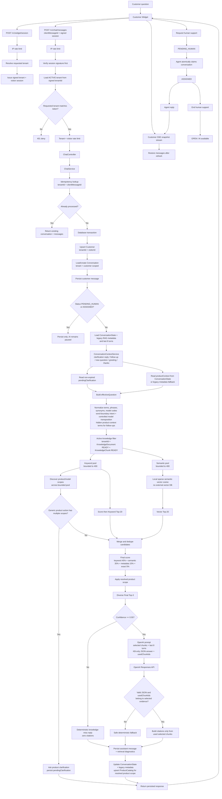

# Current Chat System Flow

```mermaid
flowchart TD
    U["Customer question"] --> W["Customer Widget"]
    W --> S0["POST /v1/widget/session"]
    S0 --> IP0["IP rate limit"]
    IP0 --> T0["Resolve requested tenant"]
    T0 --> ST["Issue signed tenant + visitor session"]

    W --> M0["POST /v1/chat/messages<br/>clientMessageId + signed session"]
    M0 --> IP1["IP rate limit"]
    IP1 --> G1["Verify session signature first"]
    G1 --> T1["Load ACTIVE tenant from signed tenantId"]
    T1 --> TM{"Requested tenant matches token?"}
    TM -- "No" --> DENY["401 deny"]
    TM -- "Yes" --> RL["Tenant + visitor rate limit"]
    RL --> CC["ChatController"]
    CC --> CS["ChatService"]

    CS --> ID["Idempotency lookup<br/>tenantId + clientMessageId"]
    ID --> DUP{"Already processed?"}
    DUP -- "Yes" --> EXISTING["Return existing conversation + messages"]
    DUP -- "No" --> TX1["Database transaction"]
    TX1 --> CU["Upsert Customer<br/>tenantId + visitorId"]
    CU --> CV["Load/create Conversation<br/>tenant + customer scoped"]
    CV --> SAVE["Persist customer message"]
    SAVE --> HS{"Status PENDING_HUMAN or ASSIGNED?"}
    HS -- "Yes" --> HUMANWAIT["Persist only; AI remains paused"]
    HS -- "No" --> CTX["Load ConversationState + legacy RAG metadata<br/>and last 8 turns"]

    CTX --> CLASS["ConversationContextService<br/>clarification reply / follow-up / new question / greeting / thanks"]
    CLASS --> PEND["Read non-expired pendingClarification"]
    CLASS --> PC["Read productContext from ConversationState<br/>or legacy metadata fallback"]
    PEND --> EQ["Build effectiveQuestion"]
    PC --> EQ
    EQ --> NQ["Normalize terms, phrases, synonyms, model codes<br/>word-boundary intent + controlled model transposition<br/>hidden product-context terms for follow-ups"]

    NQ --> ACTIVE["Active knowledge filter<br/>tenantId + KnowledgeDocument READY + KnowledgeChunk READY"]
    ACTIVE --> KWPOOL["Keyword pool<br/>bounded to 400"]
    ACTIVE --> SEMPOOL["Semantic pool<br/>bounded to 400"]
    KWPOOL --> KWRANK["Score then Keyword Top-20"]
    SEMPOOL --> LOCALV["Local sparse semantic vector cosine<br/>no external vector DB"]
    LOCALV --> VRANK["Vector Top-20"]
    KWPOOL --> PRODUCTS["Discover product/model scopes<br/>across bounded pool"]
    PRODUCTS --> AMB{"Generic product action has multiple scopes?"}

    AMB -- "Yes" --> CLARIFY["Ask product clarification<br/>persist pendingClarification"]
    CLARIFY --> RESP["Return persisted response"]
    AMB -- "No" --> MERGE["Merge and dedupe candidates"]
    KWRANK --> MERGE
    VRANK --> MERGE
    MERGE --> WEIGHT["Final score<br/>keyword 45% + semantic 35% + metadata 15% + exact 5%"]
    WEIGHT --> SCOPE["Apply resolved product scope"]
    SCOPE --> TOP["Diverse Final Top-3"]
    TOP --> CONF{"Confidence >= 0.55?"}

    CONF -- "No" --> SAFE["Deterministic knowledge-miss reply<br/>zero citations"]
    CONF -- "Yes" --> PROMPT["OpenAI prompt<br/>selected chunks + last 8 turns<br/>KB-only JSON answer + usedChunkIds"]
    PROMPT --> MODEL["OpenAI Responses API"]
    MODEL --> VALID{"Valid JSON and usedChunkIds<br/>belong to selected evidence?"}
    VALID -- "No" --> FALLBACK["Safe deterministic fallback"]
    VALID -- "Yes" --> CIT["Build citations only from used selected chunks"]
    SAFE --> TX2["Persist assistant message + retrieval diagnostics"]
    FALLBACK --> TX2
    CIT --> TX2
    TX2 --> RAGMETA["Update ConversationState + legacy metadata<br/>upsert ProductCatalog for resolved product scope"]
    RAGMETA --> RESP
    RESP --> W

    W --> SSE["Customer SSE snapshot stream"]
    SSE --> RESTORE["Restore messages after refresh"]

    W --> HR["Request human support"]
    HR --> PENDING["PENDING_HUMAN"]
    PENDING --> CLAIM["Agent atomically claims conversation"]
    CLAIM --> ASSIGNED["ASSIGNED"]
    ASSIGNED --> REPLY["Agent reply"]
    REPLY --> SSE
    ASSIGNED --> END["End human support"]
    END --> OPEN["OPEN / AI available"]
```
